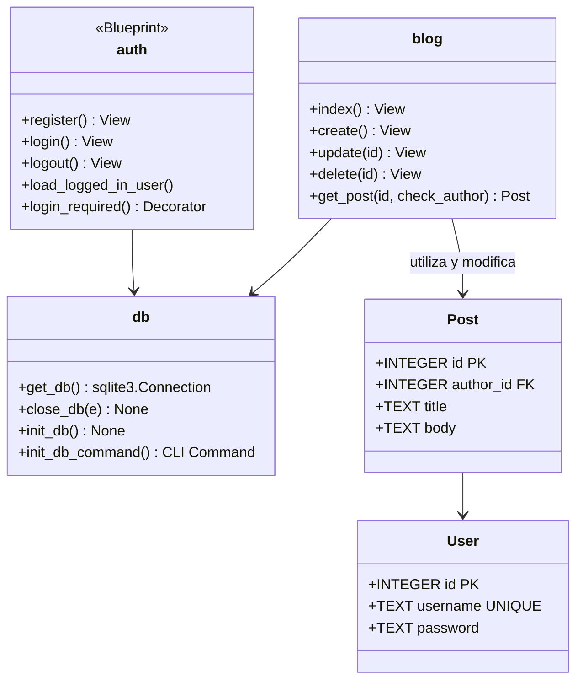

# Diagrama de sequencia

```mermaid
classDiagram
    class auth {
        <<Blueprint>>
        +register() View
        +login() View
        +logout() View
        +load_logged_in_user() 
        +login_required() Decorator
    }
    class blog {
        +index() View
        +create() View
        +update(id) View
        +delete(id) View
        +get_post(id, check_author) Post
    }
    class db {
        +get_db() sqlite3.Connection
        +close_db(e) None
        +init_db() None
        +init_db_command() CLI Command
    }
    class User {
        +INTEGER id PK
        +TEXT username UNIQUE
        +TEXT password
    }

    class Post {
        +INTEGER id PK
        +INTEGER author_id FK
        +TEXT title
        +TEXT body
    }
    auth --> db 
    blog --> db 
    blog --> Post : utiliza y modifica
    Post --> User 
```

