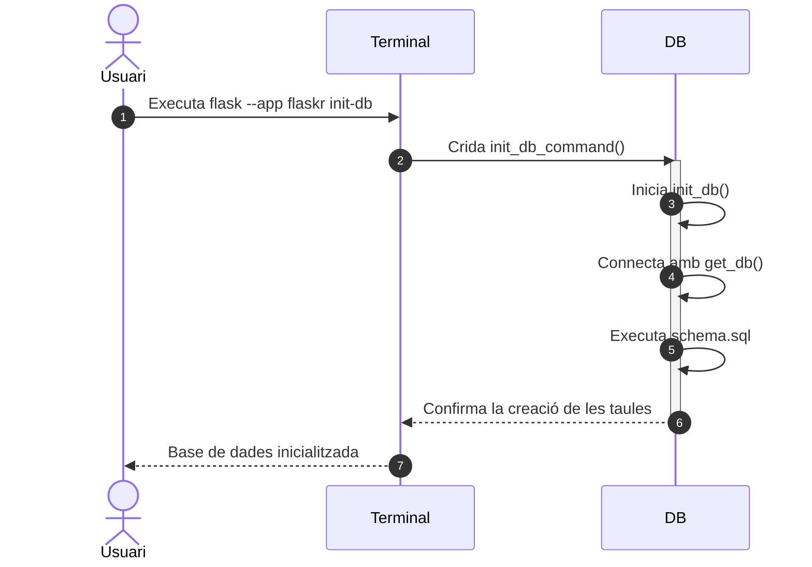
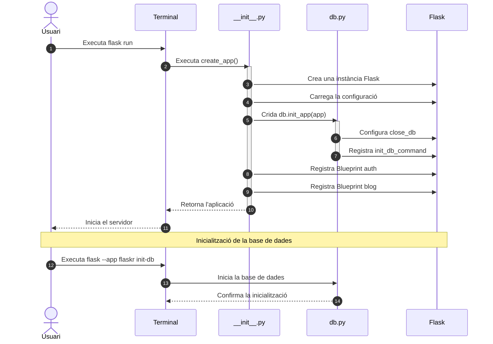
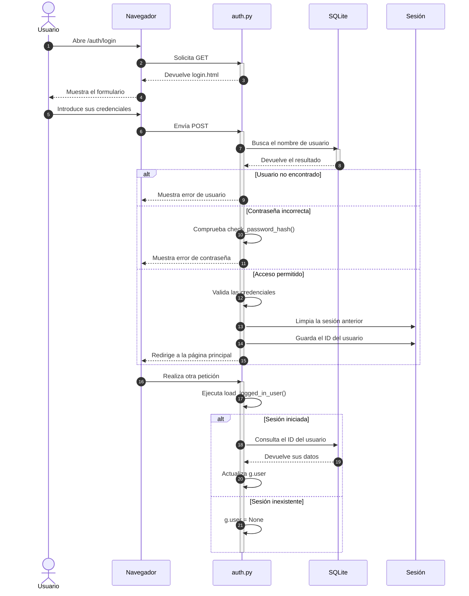

1. Init Database

```mermaid
sequenceDiagram
    autonumber
    actor Usuari
    participant Terminal
    participant DB

    Usuari->>Terminal: Executa flask --app flaskr init-db
    Terminal->>DB: Crida init_db_command()
    activate DB
    DB->>DB: Inicia init_db()
    DB->>DB: Connecta amb get_db()
    DB->>DB: Executa schema.sql
    DB-->>Terminal: Confirma la creació de les taules
    deactivate DB
    Terminal-->>Usuari: Base de dades inicialitzada
```

2. Arrencada de l'aplicació

```mermaid
sequenceDiagram
    autonumber
    actor Usuari
    participant CLI as Terminal
    participant Init as __init__.py
    participant DB as db.py
    participant App as Flask

    Usuari->>CLI: Executa flask run
    CLI->>Init: Executa create_app()
    activate Init
    Init->>App: Crea una instància Flask
    Init->>App: Carrega la configuració
    Init->>DB: Crida db.init_app(app)
    activate DB
    DB->>App: Configura close_db
    DB->>App: Registra init_db_command
    deactivate DB
    Init->>App: Registra Blueprint auth
    Init->>App: Registra Blueprint blog
    Init-->>CLI: Retorna l'aplicació
    deactivate Init
    CLI-->>Usuari: Inicia el servidor

    Note over Usuari, App: Inicialització de la base de dades
    Usuari->>CLI: Executa flask --app flaskr init-db
    CLI->>DB: Inicia la base de dades
    DB-->>CLI: Confirma la inicialització
```

3. Login

```mermaid
sequenceDiagram
    autonumber
    actor Usuario
    participant Browser as Navegador
    participant Auth as auth.py
    participant DB as SQLite
    participant Session as Sesión

    Usuario->>Browser: Abre /auth/login
    Browser->>Auth: Solicita GET
    activate Auth
    Auth-->>Browser: Devuelve login.html
    deactivate Auth
    Browser-->>Usuario: Muestra el formulario

    Usuario->>Browser: Introduce sus credenciales
    Browser->>Auth: Envía POST
    activate Auth
    Auth->>DB: Busca el nombre de usuario
    activate DB
    DB-->>Auth: Devuelve el resultado
    deactivate DB

    alt Usuario no encontrado
        Auth-->>Browser: Muestra error de usuario
    else Contraseña incorrecta
        Auth->>Auth: Comprueba check_password_hash()
        Auth-->>Browser: Muestra error de contraseña
    else Acceso permitido
        Auth->>Auth: Valida las credenciales
        Auth->>Session: Limpia la sesión anterior
        Auth->>Session: Guarda el ID del usuario
        Auth-->>Browser: Redirige a la página principal
    end
    deactivate Auth

    Browser->>Auth: Realiza otra petición
    activate Auth
    Auth->>Auth: Ejecuta load_logged_in_user()
    alt Sesión iniciada
        Auth->>DB: Consulta el ID del usuario
        DB-->>Auth: Devuelve sus datos
        Auth->>Auth: Actualiza g.user
    else Sesión inexistente
        Auth->>Auth: g.user = None
    end
    deactivate Auth
```